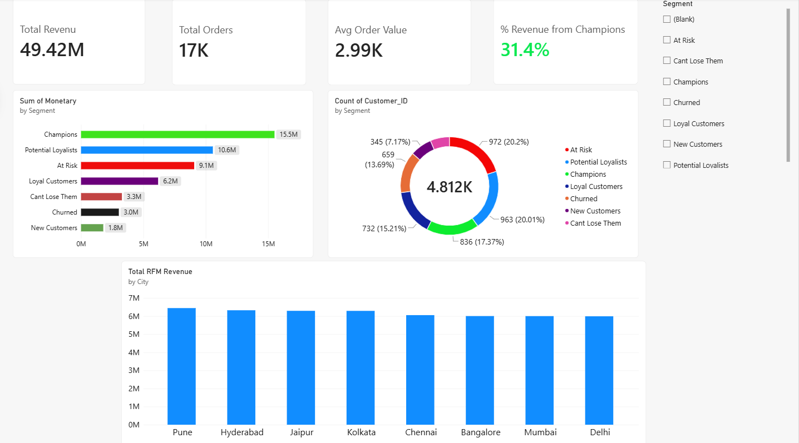

# Customer Sales & Churn Analytics

End-to-end analytics project segmenting 4,800+ customers by purchase behavior using RFM
(Recency, Frequency, Monetary) analysis, revealing that the top 17% of customers
("Champions") generate 31% of total revenue — with ₹90L+ in additional revenue
sitting in an "At Risk" segment that hasn't been re-engaged.

## Dashboard



## Business Insight

- **Champions (836 customers, 17%) drive ₹1.55Cr — 31.4% of total revenue.**
- **"At Risk" customers (972, 20%) still represent ₹90.7L in historical value** — the
  single largest opportunity for a win-back campaign.
- **"Can't Lose Them" (305 customers)** were previously frequent, high-value buyers who
  have gone quiet — smallest segment, highest priority.

## Tech Stack

- **Python** (Pandas, NumPy) — data cleaning and RFM score computation
- **SQL** (Oracle SQL*Plus) — star-schema data model, cohort and churn queries,
  window functions (RANK, running totals)
- **Power BI** (DAX) — interactive dashboard with segment, geographic, and KPI views

## Data

Simulated Flipkart-style e-commerce dataset: 5,000 customers, 10,000 products,
1,000 sellers, 16,540 completed orders across 2023.

## Pipeline

1. **Clean** raw sales data — filter to `Delivered` orders only, remove invalid
   transactions, fix data types (`notebooks/01_cleaning_and_rfm.ipynb`)
2. **Score** every customer on Recency, Frequency, and Monetary value using NumPy
   quantile binning, then classify into 7 behavioral segments
3. **Load** cleaned tables into Oracle via generated SQL insert scripts
   (`sql/load_scripts/`)
4. **Query** cohort and churn patterns — revenue by segment, at-risk customers by
   city, top categories per segment, window-function rankings
   (`sql/cohort_queries.sql`)
5. **Visualize** in Power BI — KPI cards, segment revenue/count breakdown, and
   city-level revenue, with DAX measures for dynamic filtering

## Repository Structure

```
customer-sales-churn-analytics/
├── README.md
├── data/                          # cleaned datasets
│   ├── customers.csv
│   ├── products.csv
│   ├── sellers.csv
│   └── sales_clean.csv
├── notebooks/
│   └── 01_cleaning_and_rfm.ipynb  # Pandas cleaning + NumPy RFM scoring
├── sql/
│   ├── load_scripts/              # generated SQL insert scripts
│   └── cohort_queries.sql         # joins, aggregations, window functions
└── dashboard/
    ├── customer_churn_dashboard.pbix
    └── screenshots/
        └── overview.png
```

## Author

Manish Hunkeri — [LinkedIn](https://linkedin.com/in/manishhunkeri) ·
[GitHub](https://github.com/Manishhunkeri04)
